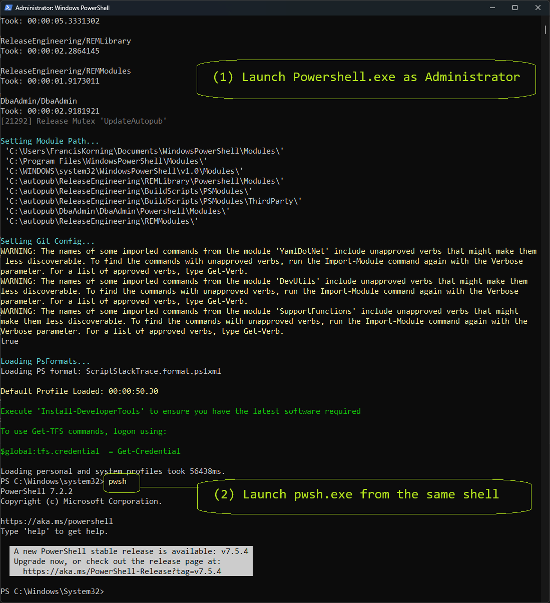

# Powershell Primer


A scrapbook and quick guide to help me understand powershell, which I struggle with.

Powershell is a fork of UNIX/POSIX Korn Shell (ksh), but mangled in the Microsoft way.

Microsoft has aded new features, but broken a lot of what makes a POSIX shell useful.

On the good side, integrated MS Windows APIs (like POSIX system calls) is brilliant.


* Caveats

- Backslash as file separator: it must be doubled for escape chars (ex in sed regexps).
  
- Case insensitive - not just filenames, but also variables, functions, API calls, etc.
  
- Named parameters and arguments - POSIX often uses positional options, not Powershell.
  
- No script argument shift operator (cause powershell hates positional parameters, eh?).
  
- Serious inconsistencies in handling console terminal, stderr, stdout, capturing output.
  
- Some duplicate PWSH commands conflict with older DOS/CMD or GNU POSIX Gitbash ones.
  
        dir
        ls
        rm
        md
        find


# Quick guide:





* PWSH vs Powershell

The choco powershell package only installs a legacy version 5.1 as `powershell.exe`.

Use the choco Powershell-Core package to install a modern version 7.2 as `pwsh.exe`.


    choco install powershell
    choco install powershell-core


The two can and will co-exist with each other.  Starting Powershell starts v 5.1.

After the init scripts run, manually run `pwsh` to launch a 7.2 within the old one.

    PS C:\Windows\system32> pwsh.exe


* File structure

The underlying Operating system is the usual DOS/CMD/NTFS windows file structure.

Drives are a letter followed by colon `C:\`. Directories use the `\` File seprator.

Paths in double-quotes `"` will do expression expansion, for example: `"$env:APPDATA"`

Expansion will also convert UNIX slash `/` seprataors to Windows backslash `\` ones.


Useful file navigation:

    pwd
    pushd
    popd

    cd ~                    ->  C:\Users\<UserName>
    cd $env:USERPROFILE     ->  C:\Users\<UserName>
    cd $env:APPDATA         -> C:\Users\<UserName>\AppData\Roaming    
    cd $env:PROGRAMFILES    -> C:\ProgramFiles


# Variables

Understand Variables, Arguments, Parameters, Options etc...

## Shell variables

Ephemeral Variables in the current script.

    $arg = "hello world"


* echo (stdout)

Note how the case doesn't matter, $ARG == $Arg == $arg.

    echo "$Arg"

    hello world


## Environment variables

These map to/from the DOS/CMD Windows User or System Environment variables.

    $env:SSH_HOME = "$env:USERPROFILE\.ssh"


By default overrides exist during the same shell session (across scripts).

    TF_PLUGIN_LOCAL_DIR "$env:USERPROFILE\terraform.d\plugins"


Use the `setx` command to persist them as long-term as Machine Env Vars.

    setx TF_PLUGIN_LOCAL_DIR "$env:USERPROFILE\terraform.d\plugins"


## Script Parameters

Powershell `.ps1` scripts expect Named Parameters with a single hyphen.

These are always case-insentitive.  The following are all equivalent.


    .\MyScript.ps1 -FILE toto.txt
    .\MyScript.ps1 -File toto.txt
    .\MyScript.ps1 -file toto.txt


Parameters are defined in Param block:

```powershell
# MyScript.ps1

param(
    [string]File
)

```

Paremeters can be positional, have an optional Alias, and have default values.

```powershell
param(
   [Parameter(Mandatory, Position = 0)]
   [string]$FirstName,
   [Parameter(Position = 1)]
   [string]$LastName = "Doe"
)

Write-Output "Hello, $FirstName $LastName"
```


In addition, the usual Korn-Shell UNIX/POSIX positional arguments are valid.

However, there is no built-in arg `shift` method, which sucks for arg parsing.

```powershell
Write-Output "First argument: $($args[0])"
Write-Output "Second argument: $($args[1])"
```


# Types

## Boolean types

Instead of POSIX booleans (0 or 1), Powershell uses `$False` and `$True`.

Try to use these, otherwise type-casting complications will cause headaches.

```powershell
    $isEnabled = $True
```


## String types

Single quotes for immutable literal Strings.
Double quotes for expansion (may contain $variables or unix-style paths).


```powershell
    realpath = '\work\workspace\dsp\iac'

    unixpath = "/work/workspace/dsp/iac/"

    usertemp = "$env:APPDATA/temp"
```

# Operators, Methods, Functions, Commands...


GNU UNIX/POSIX shells typically have a number of internal built-in operators and methods.

Powershell has also integrated its native Windows APIs, ie to make Windows System Calls.

That is brilliant, but it also means there are way too many in-scope methods and calls.

Take care naming Functions and script that they are not conflicting with existing ones.


# Built-in Methods


At minimum you should know the `echo` method, absolutely necessary to debug scripts.

```powershell
    echo "Hello world, hello $env:USERNAME."

    Hello world, hello FrancisKorning.
```


More on Built-in Methods and Windows API methods later.


# Built-in Operators


Most operators are binary and are used to manipulate vriables and construct expressions.

There are also a number of boolean comparison operators,a nd a ternary assignment operator.

* Conditional Expressions

```powershell
    if ($Path) {
        echo "Path specfied:  $Path"
    } else {
        echo "Path not sepcified"
        return -1
    }
```

# Boolean Operators

Powershell favours named boolean operators `-and`, `-or`,  `not` rather than symbols.


# Numeric Operators


Powershell favours named numeric operators (`-eq -ne -lt -gt -le -ge`) rather than symbols.


``` powershell
    # Equal
    10 -eq 10        # True

    # Not equal
    10 -ne 5         # True

    # Greater than
    15 -gt 10        # True

    # Less than
    3 -lt 8          # True

    # Greater than or equal
    5 -ge 5          # True

    # Less than or equal
    4 -le 6          # True
```

# String Operators
  
Powershell uses string operators `-eq` and `-ne` much like most GNU UNIX/POSIX shells.

It also adds a case-insenstive-equals `-ce`  operator to handle its case-insensitivity.


```powershell  
    # Output: Strings are equal
    $string1 = "Hello"
    $string2 = "hello"

    if ($string1 -eq $string2) {
        Write-Output "Strings are equal."
    } else {
        Write-Output "Strings are not equal."
    }
```


For case-sensitive comparison, use the -ceq operator:

```powershell  
    # Output: Strings are not equal
    $string1 = "Hello"
    $string2 = "hello"

    if ($string1 -ceq $string2) {
        Write-Output "Strings are equal."
    } else {
        Write-Output "Strings are not equal."
}
```


In additon a built-in .Equals() method provides more flexibility.

```powershell  
    # Output: Strings are equal
    $string1 = "PowerShell"
    $string2 = "powershell"

    if ($string1.Equals($string2, [System.StringComparison]::OrdinalIgnoreCase)) {
        Write-Output "Strings are equal."
    } else {
        Write-Output "Strings are not equal."
    }
```


# Ambiguous Equals and Not-Equals

Like UNIX/POSIX, there is ambiguity with `-eq` and `-ne` which can be either Numeric or String.

Encapsulate all strings in either single-quote 'literals' or double-quote string "expressions".

Sometimes that is not enough, in those cases you will have to do so some manual type-casting.


# Type-Casting

Powershell uses the `[type]$variable` syntax to cast a variable to a desired type.

```powershell
    # Cast string to integer
    $string = "42"
    [int]$integer = $string

    # Verify the type and perform arithmetic
    $integer.GetType().Name # Output: Int32
    $result = $integer + 8 # Output: 50
```


# Calling Context

A lot of script errors are due to a failure to understand the calling context.

All internal methods, API calls, and `COMPSEC` command scripts in are in scope!

If you are in a powershell script, all defined functions are also in scope.

Know when calling a method, function, or a command script - use `echo` traces!

.

The GNU POSIX `which` command is useful to determine if a command is GitBash one.

The following shows that the `ln` command is a GitBash one (in `/usr/bin/ln`).

```powershell    
    lnCommand = $(which ln)
    echo "ln command: $lnCommand"

    /usr/bin/ln.exe
```


# Calling Commands

Shell scripts are used to automate the chaining of operating system commands.

Thus, the most basic operation is to be able to call another command or script.

.

Some commands are shell built-in commands, including legacy CMD ones and DOS ones.

Others are scripts in the OS command path and spec: `.exe`, `.com`, `.bat`, `.ps1`.


# Command Context


Powershell command options use Named Arguments with a single hyphen.

```powershell
    ls -Path \*Windows

    C:\Windows
```

These can also be legacy DOS/CMD commands with positional arguments:

```powershell
    dir c:\*windows

    C:\Windows
```

Finally these commands can be POSIX commands with getopt options:

```powershell
    C:\Progra~1\Git\usr\bin\ls.exe -ad 'C:/Windows*'

    C:\Windows
```


# Output Streams


Like all UNIX/POSIX, and even DOS and CMD, the OS uses ANSI-C/C++/C# output streams:

0 = stdin (Input Stream), 1 = stdout (Output Stream), and 2 = stderr (Error Stream).


# Output redirects

The internal `cat` command prints file contents.

```powershell
    cat C:\Windows\System32\drivers\etc\lmhosts.sam

    # Copyright (c) 1993-1999 Microsoft Corp.
    #
    # This is a sample LMHOSTS file used by the Microsoft TCP/IP for Windows.
    ...
```

The output of a command can be redirected using the `>` symbol to another file.

For files, a redirect `>` will overwrite the entire file, erasing old contents.

```powershell
    $env:DOCKER_HOST=tcp://192.168.59.103:2375
    setx DOCKER_HOST tcp://192.168.59.103:2375

    echo    "192.168.59.103      docker  docker-local-machine"    > C:\Windows\System32\drivers\etc\lmhosts.sam
```

The double `>>` operator allows to append to a stream, preserving old content.

```powershell
    echo    "10.50.36.146        nexus  docker-nexus-registry"    >> C:\Windows\System32\drivers\etc\lmhosts.sam
```

# Suppressing stderr


It is often useful to suppress the stderror output to skip expected errors.

For example, by default pushd and popd print their current working directory.

We often use pushd and popd to programmatically navigate to a directory.

.

Powershell uses `$null` instead of the usual POSIX `/dev/null` null-device. 

The redirection syntax is different, using `*>` for both stdout + strderr.

```powershell
    pushd $env:APPDATA *> $null

    popd > /dev/null *> $null
```


# Piping Commands

The Pipe `|` symbol is used to pipe or chain commands together, that is to pass

the stdout output stream of one command as the stdin input stream of a second.


```powershell
    cat C:\Windows\System32\drivers\etc\lmhosts.sam  | grep 'docker'

    192.168.59.103      docker  docker-local-machine
    10.50.36.146        nexus  docker-nexus-registry
```


# Calling POSIX Commands

Be careful when calling GitBash, Msys, Cygwin, WSL or any other POSIX UNIX or Linux commands.

The native powershell expects Windows Paths and will consider slashes as `\` path separators.

You need to escape this by using a double-slash `\\`.

```powershell
    echo $env:APPDATA | tr '\\' '/'
    
    C:/Users/FrancisKorning/AppData/Roaming
```


# SED Regular Expressions

Installed with `GitBash`, the GNU POSIX `sed` command is quasi essential for scpiptin. 

Note this is not a Powershell command, it is an external GNU LINUX/UNIX/POSIX executable.

To use it fromPowershell, you will have to use a double-slash `\\` for escape characters.


```powershell
    echo $env:APPDATA | sed -e 's/\\/\//g'
    
    C:/Users/FrancisKorning/AppData/Roaming
```


# Functions

There are a few syntaxes to define Powershell functions and parameters.

The ones below use the simple vanilla case, with a single $Path param.


```powershell
# helper functions

# test if file is a link
Function IsLink ($Path) {
    if (-not $Path) {return}
    ((Get-Item $Path).Attributes.ToString() -match "ReparsePoint")
}

# test if file exists
Function IsFile ($Path) {
    if (-not $Path) {return}
    (Test-Path -Path $Path -PathType Leaf)
}

# test if directory exists
Function IsDir ($Path) {
    if (-not $Path) {return}
    (Test-Path -Path $Path -PathType Container)
}

```


To call a function, just pass the necessary parameter(s).


```powershell
# local terraform provider plugins modules
$env:TF_PLUGIN_CACHE_DIR="$env:APP_DATA/terraform.d/plugin-cache"
$env:TF_PLUGIN_LOCAL_DIR="$env:APP_DATA/terraform.d/plugins"
$env:TF_MODULE_LOCAL_DIR="$env:APP_DATA/terraform.d/modules"

# create lib dirs for  plugins and modules
if (-not (IsDir  -Path $env:TF_PLUGIN_CACHE_DIR ))          { mkdir -p   $env:TF_PLUGIN_CACHE_DIR }
if (-not (IsDir  -Path $env:TF_PLUGIN_LOCAL_DIR ))          { mkdir -s   $env:TF_PLUGIN_LOCAL_DIR }
if (-not (IsDir  -Path $env:TF_MODULE_LOCAL_DIR ))          { mkdir -p   $env:TF_MODULE_LOCAL_DIR }

```

# Passing Dynamic Params

Parameter lists are just liasts, ie arrays and can be constucted dynamically.


```powershell
$Params = @{
    Path = "C:\Temp"
    Filter = "*.txt"
    Recurse = $true
}

Get-ChildItem @Params
```


# Function Returns

Unlike real programming languages, OS scripting language functions do not return a value.

Well that's a lie, they return a condition code; to return one or more typed output values,

you can specify global typed parameters that the function sets before it exits.

You can also just echo values to stdout, and pass them in other calls a '|' pipe.


# Built-in methods
  
 Like `Echo`,  `Write-Host`,  `Write-Output`, and `Write-Error` write to stdout and stderr.


 * Read-Host method

 There is also of course a `Read-Host` and `Read-Input` to read from stdin or a stream.

 Secrets, for example passwords, can use Masking to be obscured (have their echo suppressed).


```powershell
    $password = Read-Host -MaskInput "Enter password"
```


#  Get-Children method

`Get-Children` is akin to the UNIX/POSIX `find` util, it alows to selec files and directories.

```powershell
    $lock = Get-ChildItem ".lock"
    echo "found .lock semaphore: $file"
```


#  ForEach-Object method

`ForEach-Object` is the Powershell For-Loop construct, it operates on streams or argument lists.

```powershell
    $files = Get-ChildItem *.txt
    foreach ($file in $files) {
        echo "found file: $file"
    }    
```


# Fast Returns

Fast-Returns (aka Short-Circuits) can be used to break-off functions or loops early.

```powershell
    $files = Get-ChildItem log.*
    $i = 0
    foreach ($file in $files) {     
        i = i + 1 
        if ($file -eq "log.$i")
        echo "found log: $file"
        return
    }
```


# Script Exits

The Exit method is like Return but it exits an entire script, returning a status code.

The status code for Success is Zero (0), anything else is an error or failure code.

.

The polite way to do this is to also use `host.setShouldExit` to notify any callers.

Also note the use of `Write-Error` to print an error or failure message on stderr.


```powershell
     if (-not Test-Path -Path "config.ini" -PathType Leaf)
        Write-Error "404 - Missing config-file" 
        $host.SetShouldExit(404)
        exit 404
    }
    
```


# Intermediate Powershell

_TODO_


# Lists (Arrays)


# Tuples (Vectors)


# Dictionaries (Maps)


# Objects and Classes


#  Windows API methods

For Windows-API Methods (ie System Calls), the following is a starter list.

    Get-Command
    Get-Help

    Get-Process
    Get-Service
    Get-ExecutionPolicy
    Set-ExecutionPolicy


Fortunately, more Windows-API methods are scoped with packages and object classes.

Note the use of square brackets to cast and force the scope to `[SysInfo]` API.

Note the use of double colons `::` to scope packages, classes, and objects.

```powershell
    $uptimeMs = [SysInfo]::GetTickCount()
    $uptime = [TimeSpan]::FromMilliseconds($uptimeMs)
    Write-Host "System Uptime: $($uptime.Days) days, $($uptime.Hours) hours, $($uptime.Minutes) minutes"
```

# Custom Windows APIs


For the super advanced, you can even extend and define your own Windows APIs.

Note the use of square brackets to cast and force the scope to `[WinAPI]` API.

Note the use of double colons `::` to scope packages, classes, and objects.


```powershell
    # Define MessageBox API
    Add-Type @"
    using System;
    using System.Runtime.InteropServices;
    public class WinAPI {
        [DllImport("user32.dll", CharSet = CharSet.Auto)]
        public static extern int MessageBox(IntPtr hWnd, String text, String caption, int type);
    }
    "@

    # Call MessageBox
    [WinAPI]::MessageBox([IntPtr]::Zero, "Hello from PowerShell!", "Windows API", 0)

```


# Advanced Powershell


_TODO_

# Signals

# Semaphores

# Services


# Processes


# Group Policies


# Domain Operations


